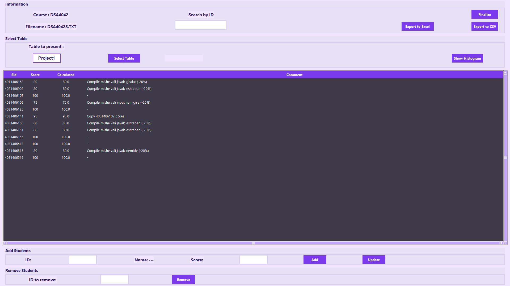
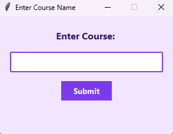
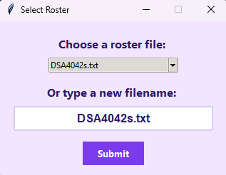
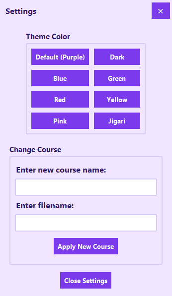
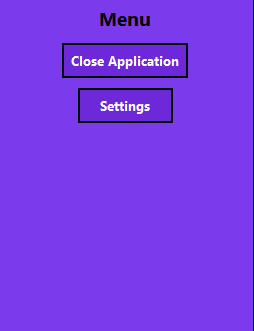
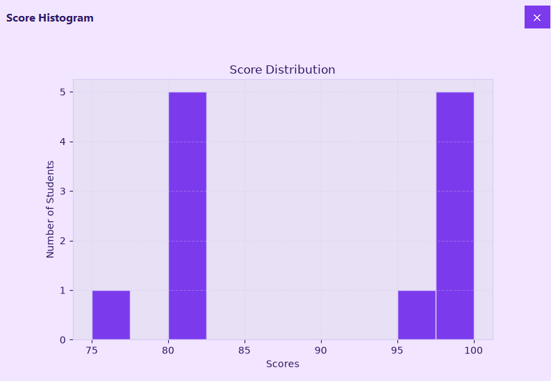
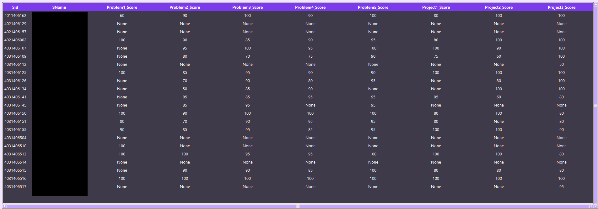

# TA Application

A desktop app for teaching assistants to manage class rosters, track and grade assignments, and export results. Built with Python and Tkinter, backed by SQLite.

## Features

- Manage multiple courses, each with its own students, tables, and grades
- Import class rosters from simple text files
- Add, update, and remove student scores with optional comments
- Auto-calculate grades against a configurable base grade
- Search and sort results in-app
- Export any table to CSV or Excel
- Visualize score distributions with a built-in histogram
- Finalize a course into a single combined grade sheet
- Switch between multiple color themes

## Screenshots

**Main window**

<div align="center">
    
    <em><p>The main window: browse a table, search by ID, sort columns, add/update/remove scores, and export or finalize a course.</p></em>
</div>

**Course setup**

<table align="center">
  <tr>
    <td align="center">
      <br>
      <em>Step 1: enter a course name to get started.</em>
    </td>
    <td align="center">
      <br>
      <em>Step 2: pick a roster file to import the class list from.</em>
    </td>
  </tr>
</table>

**Settings / themes**

<div align="center">
    
    <em><p>Switch color themes and change the active course without restarting the app.</p></em>
</div>

**Escape menu**

<div align="center">
    
    <em><p>Quick-access menu (press Esc) for opening Settings or closing the application.</p></em>
</div>

**Score histogram**

<div align="center">
    
    <em><p>Visualize the score distribution for the currently selected table.</p></em>
</div>

**Finalize course**

<div align="center">
    
    <em><p>Combine every assessment table into a single, per-student grade sheet. (names are blacked out for privacy reasons)</p></em>
</div>

## Getting Started

### Requirements

- Python 3.9+
- See [`requirements.txt`](requirements.txt) for Python dependencies

### Installation

```bash
git clone https://github.com/AmirmasoudCS/TA-application.git
cd TA-application
pip install -r requirements.txt
```

### Running

```bash
python main.py
```

On first launch, you'll be asked to enter a course name and select a roster file to import students from.

### Roster files

Roster files live in `data/rosters/` and are plain `.txt` files, one student per line, in the format:

```
Firstname Lastname StudentID
```

## Project Structure


```text
📁
├── 📁 assets
│   └── 📁 screenshots
├── 📁 data
│   └── 📁 rosters
├── 📁 db
│   ├── 🐍 __init__.py
│   ├── 🐍 assessment_repository.py
│   ├── 🐍 connection.py
│   ├── 🐍 course_repository.py
│   ├── 🐍 database.py
│   ├── 🐍 models.py
│   └── 🐍 student_repository.py
├── 📁 logs
├── 📁 services
│   ├── 🐍 __init__.py
│   ├── 🐍 export_service.py
│   ├── 🐍 roster_import_service.py
│   └── 🐍 stats_service.py
├── 📁 settings
│   └── 📝 theme_config.txt
├── 📁 ui
│   ├── 📁 widgets
│   │   ├── 🐍 __init__.py
│   │   ├── 🐍 popup.py
│   │   └── 🐍 table_view.py
│   ├── 📁 windows
│   │   ├── 🐍 __init__.py
│   │   ├── 🐍 comment_window.py
│   │   ├── 🐍 course_setup_window.py
│   │   ├── 🐍 histogram_window.py
│   │   ├── 🐍 settings_window.py
│   │   └── 🐍 update_window.py
│   ├── 🐍 __init__.py
│   ├── 🐍 main_window.py
│   └── 🐍 theme.py
├── 🐍 config.py
├── ⚖️ LICENSE
├── 🐍 logging_setup.py
├── 🐍 main.py
├── 📘 README.md
└── 📝 requirements.txt
```
> Generated using [Tree Printer](https://github.com/AmirmasoudCS/Tree-Printer.git)

## Tech Stack

- **Python** / **Tkinter** - UI
- **SQLite** - persistence
- **openpyxl** - Excel export
- **matplotlib** - score histograms

## License

See [LICENSE](LICENSE).