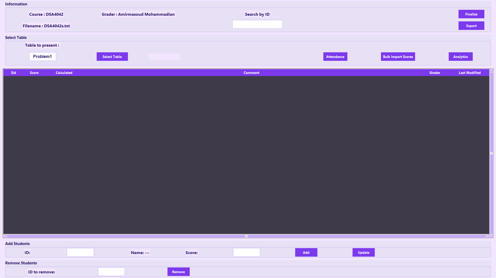
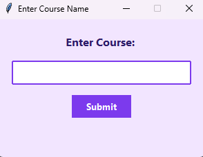
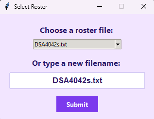
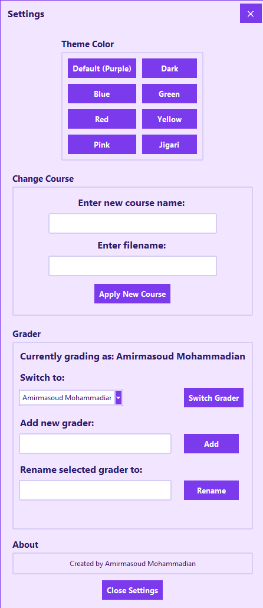
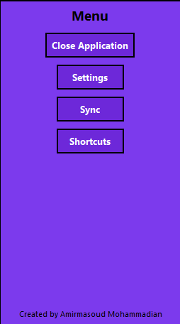
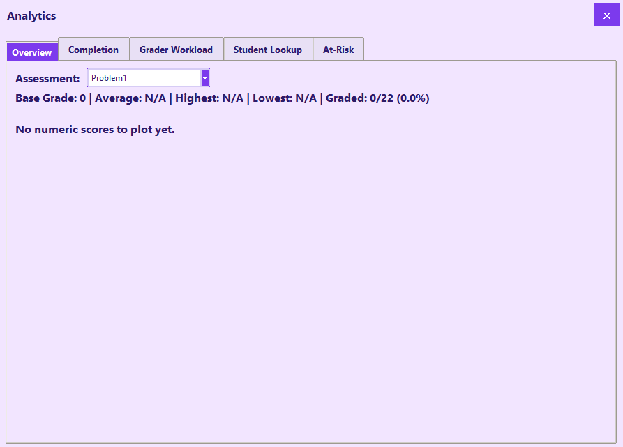
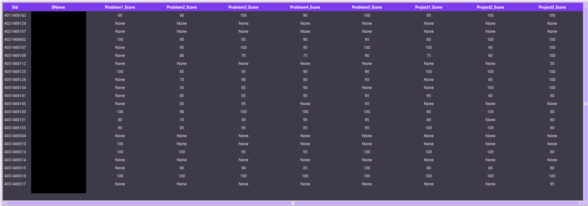

# TA Application

A desktop app for teaching assistants to manage class rosters, track and grade assignments, and export results. Built with Python and Tkinter, backed by SQLite.

## ✨ Features

- **Course & roster management**: Create multiple courses and import student rosters from text files.
- **Grading**: Add, update, and remove scores, with optional comments and automatic grade calculation.
- **Results**: Search and sort tables, visualize score distributions, and export results to CSV or Excel.
- **Course finalization**: Combine assessment tables into a single grade sheet.
- **Customization**: Switch between multiple color themes.

## 🖼️ Screenshots

### Main window

<div align="center">



<em><p>Browse tables, search students, manage scores, and export or finalize a course.</p></em>

</div>

### Course setup

<table align="center">
  <tr>
    <td align="center">
      <br>
      <em>Enter a course name.</em>
    </td>
    <td align="center">
      <br>
      <em>Select a roster file to import students.</em>
    </td>
  </tr>
</table>

### Settings / themes

<div align="center">



<em><p>Change the active course and switch color themes.</p></em>

</div>

### Escape menu

<div align="center">



<em><p>Press <code>Esc</code> to quickly access Settings or exit the application.</p></em>

</div>

### Analytics Tab

<div align="center">



<em><p>Analytics tab for more information of the data.</p></em>

</div>

### Finalize course

<div align="center">



<em><p>Combine all assessment tables into a single grade sheet. Names are blacked out for privacy.</p></em>

</div>

## 🚀 Getting Started

### Requirements

Python 3.9+ is required. Python dependencies are listed in [`requirements.txt`](requirements.txt).

### Installation

```bash
git clone https://github.com/AmirmasoudCS/TA-application.git
cd TA-application
pip install -r requirements.txt
````

### Running

```bash
python main.py
```

On first launch, enter a course name and select a roster file to import students.

### Roster files

Roster files are stored in `data/rosters/` as plain `.txt` files, with one student per line:

```text
Firstname Lastname StudentID
```

## 📁 Project Structure

```text
📁 
├── 📁 assets
│   ├── 📁 fonts
│   │   ├── 📄 Vazirmatn-Black.ttf
│   │   ├── 📄 Vazirmatn-Bold.ttf
│   │   ├── 📄 Vazirmatn-ExtraBold.ttf
│   │   ├── 📄 Vazirmatn-ExtraLight.ttf
│   │   ├── 📄 Vazirmatn-Light.ttf
│   │   ├── 📄 Vazirmatn-Medium.ttf
│   │   ├── 📄 Vazirmatn-Regular.ttf
│   │   ├── 📄 Vazirmatn-SemiBold.ttf
│   │   └── 📄 Vazirmatn-Thin.ttf
│   ├── 📁 logo
│   │   ├── 📄 icon.ico
│   │   └── 🖼️ icon.png
│   └── 📁 screenshots
│       ├── 🖼️ analytics.png
│       ├── 🖼️ enter_course.png
│       ├── 🖼️ esc_menu.png
│       ├── 🖼️ finalize.png
│       ├── 🖼️ main_window.png
│       ├── 🖼️ select_rouster.png
│       └── 🖼️ settings_menu.png
├── 📁 data
│   ├── 📁 rosters
│   └── 📁 score_imports
├── 📁 db
│   ├── 🐍 __init__.py
│   ├── 🐍 analytics_repository.py
│   ├── 🐍 assessment_repository.py
│   ├── 🐍 attendance_repository.py
│   ├── 🐍 connection.py
│   ├── 🐍 course_repository.py
│   ├── 🐍 database.py
│   ├── 🐍 models.py
│   ├── 🐍 student_repository.py
│   └── 🐍 ta_repository.py
├── 📁 logs
├── 📁 services
│   ├── 🐍 __init__.py
│   ├── 🐍 export_service.py
│   ├── 🐍 roster_import_service.py
│   ├── 🐍 score_import_service.py
│   ├── 🐍 stats_service.py
│   └── 🐍 sync_service.py
├── 📁 settings
│   └── 📝 theme_config.txt
├── 📁 ui
│   ├── 📁 widgets
│   │   ├── 🐍 __init__.py
│   │   ├── 🐍 popup.py
│   │   └── 🐍 table_view.py
│   ├── 📁 windows
│   │   ├── 🐍 __init__.py
│   │   ├── 🐍 analytics_window.py
│   │   ├── 🐍 attendance_window.py
│   │   ├── 🐍 comment_window.py
│   │   ├── 🐍 course_setup_window.py
│   │   ├── 🐍 export_window.py
│   │   ├── 🐍 score_import_window.py
│   │   ├── 🐍 settings_window.py
│   │   ├── 🐍 shortcuts_window.py
│   │   ├── 🐍 sync_window.py
│   │   ├── 🐍 ta_select_window.py
│   │   └── 🐍 update_window.py
│   ├── 🐍 __init__.py
│   ├── 🐍 main_window.py
│   └── 🐍 theme.py
├── 🐍 config.py
├── ⚖️ LICENSE
├── 🐍 logging_setup.py
├── 🐍 main.py
├── 📘 README.md
├── 📝 requirements.txt
└── 📄 TA-app.spec
```

> Generated using [Tree Printer](https://github.com/AmirmasoudCS/Tree-Printer.git).

## 🛠️ Tech Stack

| Technology           | Purpose          |
| -------------------- | ---------------- |
| **Python / Tkinter** | Desktop UI       |
| **SQLite**           | Data persistence |
| **openpyxl**         | Excel export     |
| **matplotlib**       | Score histograms |

## ⚖️ License

See [LICENSE](LICENSE).
